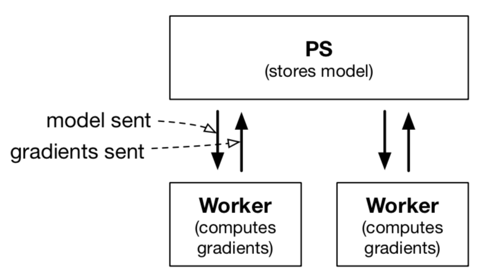
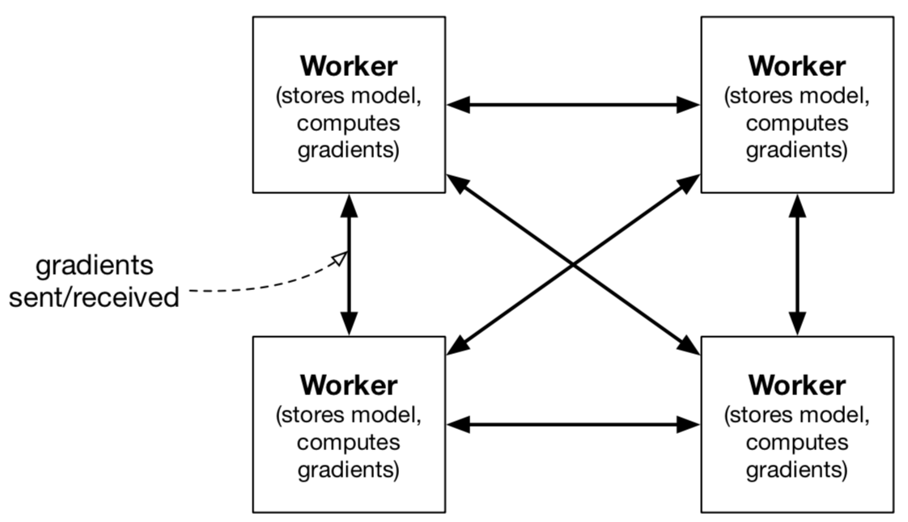

## dask-ps

This repository implements initial sketches for a Dask parameter server. The reasoning behind this is that Dask should manage the communication required for distributed optimization but leave computation to the favorite library (e.g., PyTorch, Keras).

The implementations in this repository were discussed more in https://github.com/dask/dask-ml/issues/171.

* `Centralized-PS.ipynb`: the main notebook behind this repo
* `Ring-all-reduce.ipynb`: a very rough draft of an all-reduce strategy
* `initial-sketches/`: initial versions of the centralized and decentralized
  parameter servers

There are two variants for this:

1. a centralized parameter server (PS)
    * the PS holds the model
    * give workers the model
    * tasks workers with calculating gradients
2. a decentralized parameter server
    * every worker holds the model
    * communicate only gradients

| Centralized | Decentralized |
|:----:|:------:|
|  | |

There are two different variants on the communication scheme:

1. Synchronous
    * Centralized PS: the PS waits to receive enough gradients before applying them.
    * Decentralized PS: all workers communicate their gradients to every other worker (likely via all-reduce)
2. Asynchronous
    * Centralized PS: the worker applies the gradient as soon as it's received
    * Dentralized PS: the workers don't communicate to every other worker

There is a separate issue of blocking writes/reads from the PS.

* Drafts of the implementations in `initial-sketches` are in https://gist.github.com/stsievert/ff8a1df9300a82f15a2704e913469522
* @mrocklin pushed a PS here: https://gist.github.com/mrocklin/e57551e451bd633e13009ccce9c6ff67

## Implementations
* [Horovod](https://github.com/uber/horovod), a system that works with decentralized with all-reduce.
* [Ray parameter server](https://ray.readthedocs.io/en/latest/example-parameter-server.html). This simple example implements the simplest centralized PS.
* Distributed Tensorflow: https://www.tensorflow.org/api_docs/python/tf/train/Server
* BigDL, meant for Spark: https://bigdl-project.github.io/0.6.0/#whitepaper/
* MLlib, meant for Spark: https://spark.apache.org/mllib/

## Benchmarks
* Paleo: https://talwalkarlab.github.io/paleo/. Compares the performance of different models/networks when different all-reduced algorithms are used as the number of workers scale
    * Strong scaling is more realistic but is not the default (I come to a ML system with a dataset; my dataset does not grow as I increase my workers).
* DAWNBench: useful benchmarks for deep learning models: https://dawn.cs.stanford.edu/benchmark/ (state of the art; likely not distributed)

## Algorithms
I'm more inclined to distributed the computation of gradients. These two algorithms don't do that and are decentralized.

* [Hogwild]: require async centralized PS, which holds on to a global model and workers go willy-nilly (hence the name)
* [Hogwild++]: a hogwild variant to HPC systems. Requires a decentralized system that does not have synchronous communication (the workers communicate in a ring structure)

## Papers
* ["Revisiting distributed synchronous SGD"](https://arxiv.org/pdf/1604.00981.pdf) (2017). Examines communication schemes for parameter servers. Promotes using centralized PS and extra workers. Summary in https://github.com/dask/dask-ml/issues/171#issuecomment-411137698
    * Distributed tensorflow implements this architecture: https://www.tensorflow.org/api_docs/python/tf/train/Server: it's centralized synchronous with backup workers; it throws away gradient updates that workers compute if they're too old)
* ["Scaling distributed machine learning with the parameter server"](https://www.usenix.org/system/files/conference/osdi14/osdi14-paper-li_mu.pdf) (2014).

[Hogwild]:https://papers.nips.cc/paper/4390-hogwild-a-lock-free-approach-to-parallelizing-stochastic-gradient-descent.pdf
[Hogwild++]:http://www.stat.ucdavis.edu/%7Echohsieh/wildSGD.pdf

